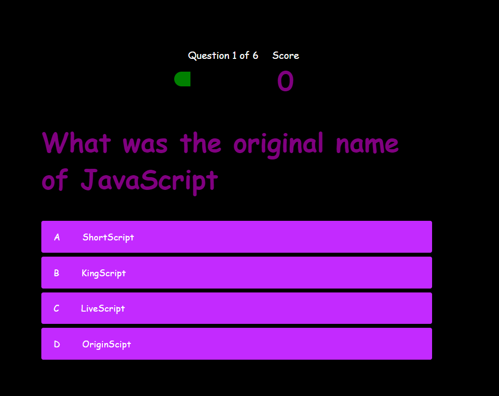
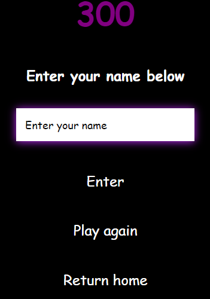
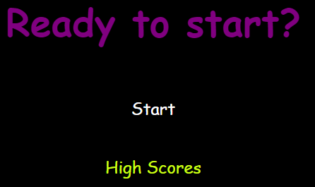
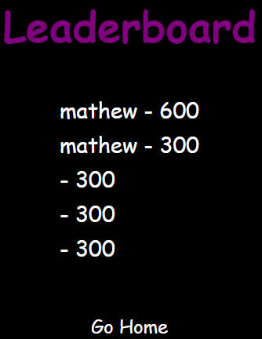

# Smartest-quiz
- With this challenge I was tasked with creating a quiz for coders.While having a scoring and highscore functions.

## Features 
-   A simple layout for this website was used with a eye pleasing black and purple design for the late night quiz fanatics.

- For the question choices a red light will appear when the wrong answer is chosen and a green when the user gets it right.

- A highscore page, welcome page, and enter your name page is in the quiz aswell.
  

## Challenges 
- The biggest obstacle for me to get over in this challenge was figuring out the function needed for the score to go up as the user got a question right and to not increase when they got a question wrong.